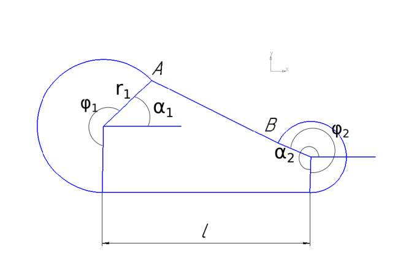
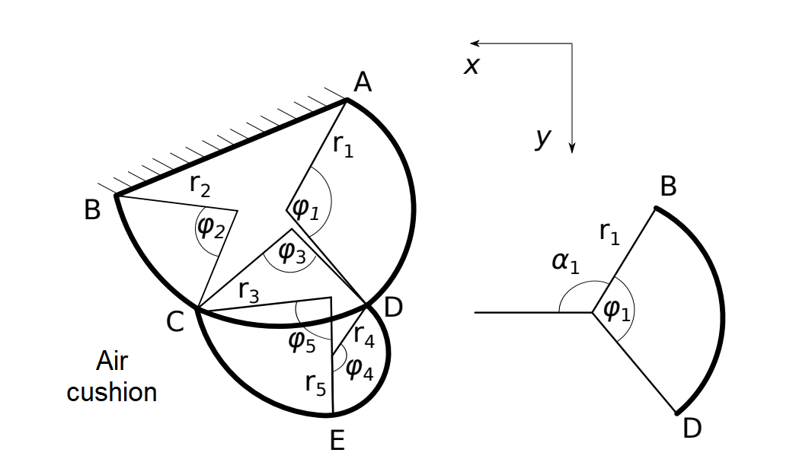

# CAIPS
<body>
    

         
        CAIPS - The task of Compressing An Inflatable Pneumatic Structure
    

    

        <a href="https://clck.ru/33sbmd"> Brainstorm desk (MS Whiteboard)</a>
    

    

        We consider the problem of compressing an inflatable pneumatic structure. The origin of coordinates is taken at the ground surface, the y-axis
is directed upward, the x-axis is to the right. Determine the deformed shape of the two-tier pneumatic shell,
that is under pressure from the air cushion. The contact with the supporting surface is neglected.
    

    

         
        
    

    
</body>
